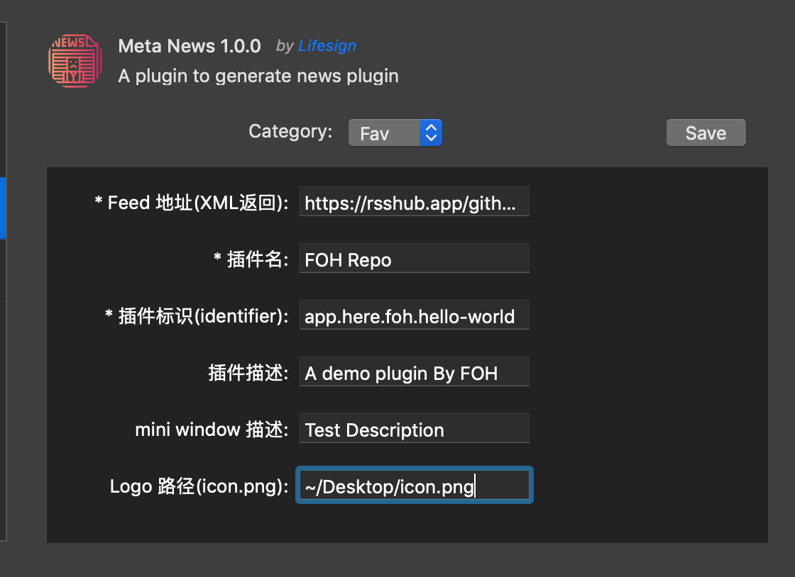

# Meta News

> 厌倦了构建新闻类插件 🙃? 尝试一下 Meta News, 一个可以生成新闻类 [Here](https://here.app) 插件的插件。

## 安装说明

### 一键安装  (推荐)
👉 <a href="https://jump.here.app/?installPlugin?title=Meta-News&url=https://github.com/FriendsOfHere/meta-news/releases/latest/download/Meta-News.hereplugin">点击这里 🔌</a>

### 手动安装
1. 打开 [releases](https://github.com/FriendsOfHere/meta-news/releases/latest/) 页面
2. 下载最新的 release & 双击 `Meta-News.hereplugin` 安装

## 使用说明
1. 进到 Meta-News 的配置页面
2. `*` 号开头的配置项必须填上
3. 保存后可以回到 mini window 预览效果
4. 在 mini window 上点击，可以在桌面生成你的插件

## 配置项

### License

The plugin is published under the [MIT License](./LICENSE.md)
